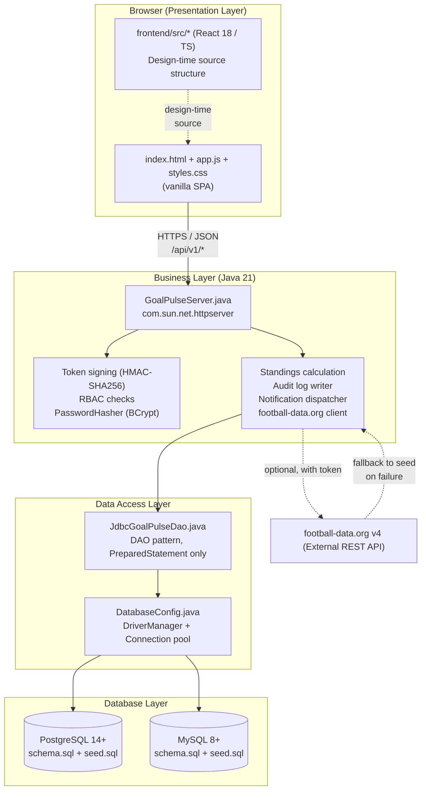

# GoalPulse — Layered Architecture Diagram

The GoalPulse system follows a strict four-tier layered architecture. Each layer has exactly one responsibility, and crossing layers always happens through a documented interface (HTTP for presentation→business, DAO methods for business→data access, JDBC `PreparedStatement` for data access→database).

## Layer responsibilities (one sentence each)

- **Presentation** renders the UI and never speaks to the database directly.
- **Business** validates requests, applies rules (RBAC, standings math, audit), and exposes JSON.
- **Data Access** translates DAO method calls into parameterized SQL and maps `ResultSet`s back to records.
- **Database** stores the relational data with FKs, CHECKs, and ON DELETE policies.

## Crossing rules (enforced by code review)

- Presentation may call **only** `/api/v1/*` endpoints.
- Business may **never** build SQL strings.
- Data Access may **never** decide on RBAC.
- Database may **never** be reached from the browser.
