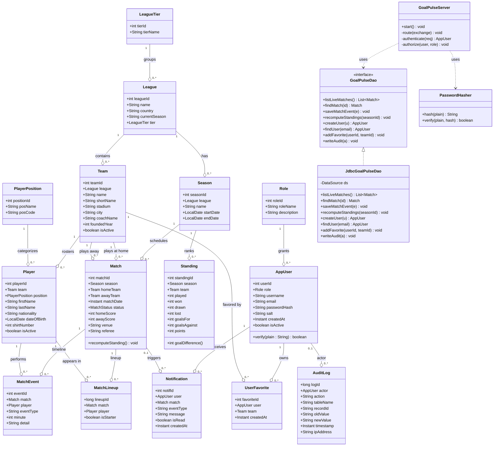

# GoalPulse — UML Class Diagram (Domain Model)

## Notes

- `GoalPulseDao` is the DAO interface; `JdbcGoalPulseDao` is the JDBC implementation. An in-memory implementation (`Store` inside `GoalPulseServer`) is used when `GOALPULSE_USE_DB` is unset.
- `MatchStatus` is an enum-like field in the schema; modeled as a `String` constrained by `CHECK status IN ('scheduled','live','finished')`.
- All identifier fields are surrogate keys (`SERIAL`/`AUTO_INCREMENT`) — no natural keys are exposed.
