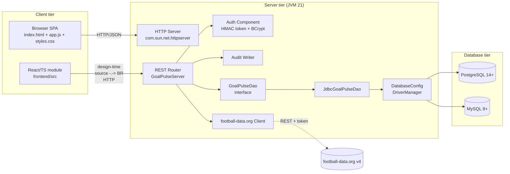

# GoalPulse — UML Component Diagram

## Deployment notes

- The browser, server, and database can all run on a single machine (typical demo).
- For a hosted deployment, place the server behind a TLS terminator (e.g., Caddy or nginx); the application server itself speaks plain HTTP.
- Only the server reaches the database; the browser never holds DB credentials.
- football-data.org credentials live only as a server-side environment variable.
