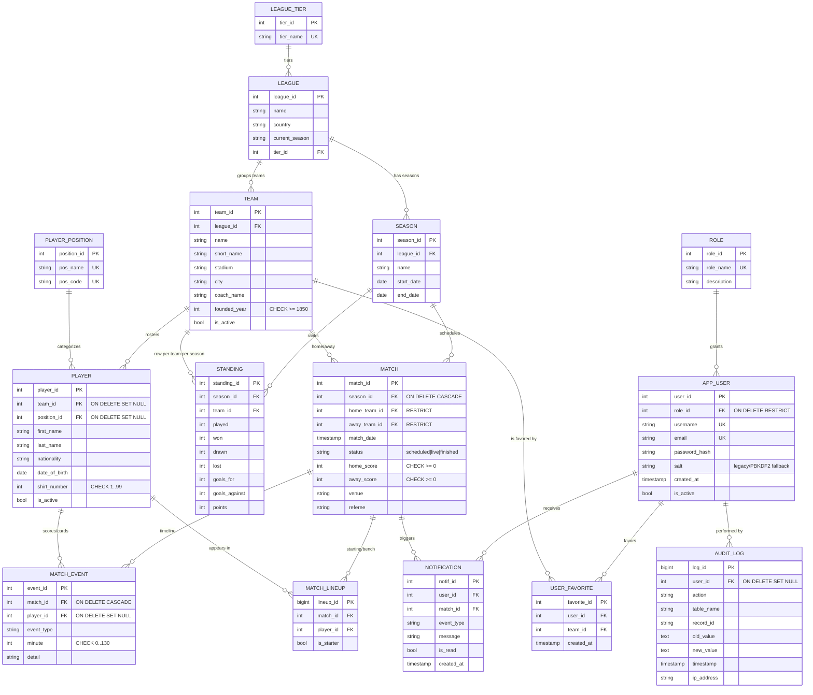

# GoalPulse — Entity-Relationship Diagram

14 tables, normalized to 3NF. Foreign keys carry explicit ON DELETE policies (CASCADE / RESTRICT / SET NULL) chosen per relationship.

## Notes

- `match` is a reserved word in MySQL. The MySQL schema uses backticks (`` `match` ``) everywhere; PostgreSQL accepts it unquoted.
- `app_user.salt` is kept for the optional PBKDF2 fallback path and is `NULL` when BCrypt is in use.
- `standing` is denormalized for quick reads; recomputation logic lives in the business layer.
- Primary keys use `SERIAL`/`BIGSERIAL` (PG) and `AUTO_INCREMENT` (MySQL).

## How to render to PNG

1. Open this file in any Mermaid-aware viewer (GitHub, VS Code with the Markdown Preview Mermaid extension, or `mermaid-cli`).
2. Or paste the diagram block into <https://mermaid.live> and export PNG.
3. Save as `docs/diagrams/erd.png` and embed in the final documentation.
