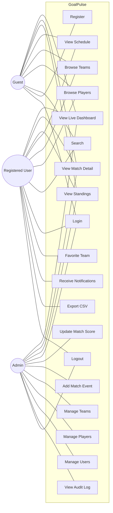

# GoalPulse — UML Use Case Diagram

Three actors: **Guest**, **Registered User**, **Admin**. Registered inherits everything Guest can do; Admin inherits everything Registered can do.

## Actor descriptions

- **Guest** — anonymous visitor. Read-only access. Can register or log in.
- **Registered User** — has an `app_user` row with `role='registered'`. Adds favorites, receives notifications, exports CSV.
- **Admin** — `role='admin'`. Performs CRUD on match data. Every write produces an `audit_log` row.

## Use-case extensions / includes

- `UC9 Login` is **«included by»** `UC10`, `UC12`, `UC13`, `UC14`, `UC15`, `UC16`, `UC17`, `UC18`.
- `UC11 Receive Notifications` **«extends»** `UC10` (only fires once a team has been favorited).
- `UC13 Update Match Score` **«includes»** `UC18 View Audit Log` write side-effect.
- `UC14 Add Match Event` **«includes»** `UC18` write side-effect.
- Denied admin attempts by Registered users are **also** logged via `UC18`.
